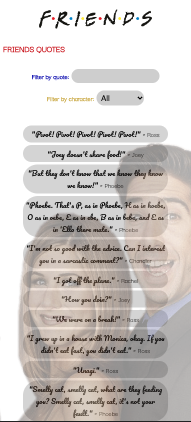
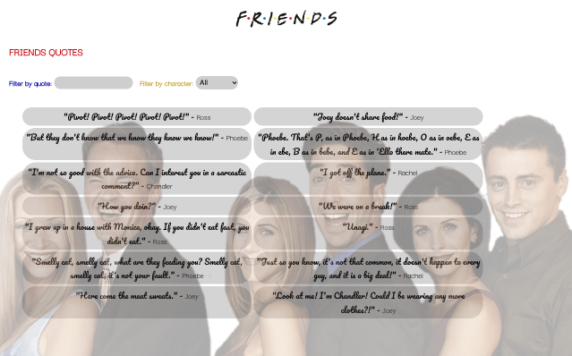

<h1 align="center">FRIENDS QUOTES</h1>

---

<div align="center">
   Solution for exrcise of module 3's intermediate evaluation by Olga Rodríguez Garrucho at <a href="https://adalab.es/">
     Adalab
    </a>.
</div>

<div align="center">
  <h3>
    <a href="olgargarrucho.github.io/Friends-quote/">
      Demo
    </a>
    <span> | </span>
    <a href="https://github.com/olgargarrucho/Friends-quote.git">
      Solution
    </a>
  </h3>
</div>

---

## Table of Contents

- [General Info](#general-info)
- [Technologies](#technologies)
- [Installation](#installation)
- [Result](#result)
- [Contact](#contact)
- [License](#license)

---

## General Info

Solution for exercise of module 3´s intermediate evaluation by Olga Rodríguez Garrucho.

Develop a web application to manage the quotes of the friends characters.

Use of HTML, SASS and React.

First, I render the list without filters. In second place, I add two filters: by quote and by character.

The filter by quote consists in an input text to search the quote that it includes its value. The filter by character is a select input with each character as value or all as default value.

The list can be filtered by quote, by character or both.

Also, you can add a new quote with the form at the end. To add a new quote you can fill in the input for quote and the input for character. When you click on add button, the new quote is added to the list and saves it at local storaged. So, the page reloads the list will appear with all quotes.

### Web responsive mobile:



### Web responsive desktop:



### Demo:


---

## Technologies

- [Visual Studio Node](https://code.visualstudio.com/download) Version: May 2022
- [Git](https://git-scm.com/download/mac) Version: 2.36.1
- [Node JS](https://nodejs.org/es/download/) Version: v14.19.3
- [Adalab Web Started Kit](https://github.com/Adalab/adalab-web-starter-kit)
- [Git Hub](https://github.com/)

---

## Installation

For open the exercise it´s necesary to do the next steps:

```
$ git clone https://github.com/olgargarrucho/Friends-quote.git
$ cd ../path/to/the/file
$npm install
$npm start
```

---

## Result

To view the final´s result of exercise click [here](olgargarrucho.github.io/Friends-quote/).

---

## Contact

- [Linkedin](https://www.linkedin.com/in/olgargarrucho)
- [GitHub](https://github.com/olgargarrucho)
- [Twitter](https://twitter.com/olgargarrucho)

---

## License

Copyright (c) 2022, Olga RG.
